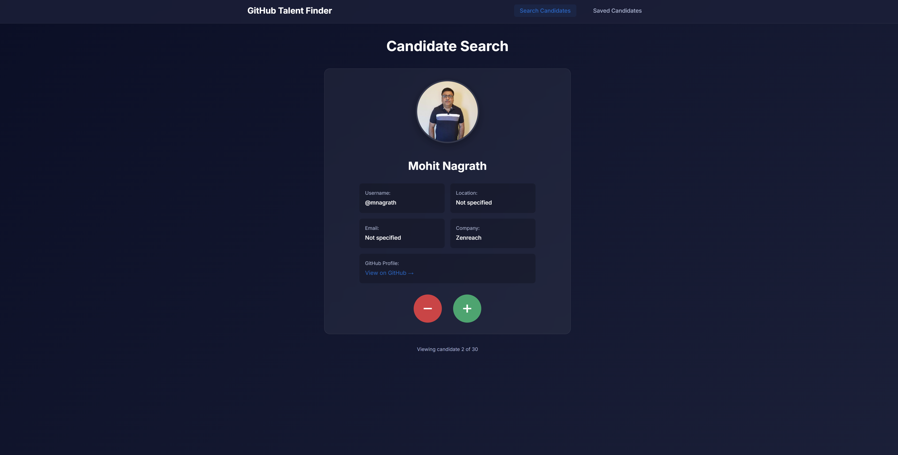
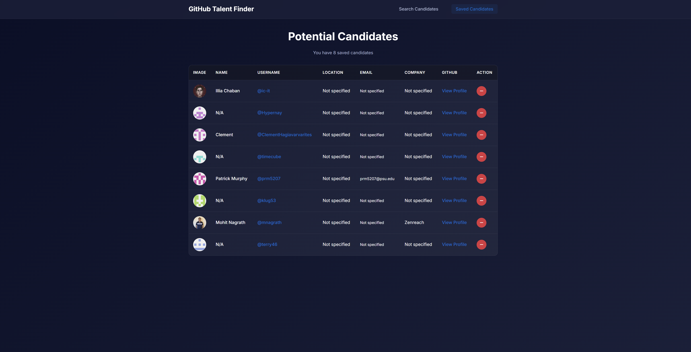

# GitHub Talent Finder

## Description

A React TypeScript application for discovering and managing GitHub developer profiles. This tool allows recruiters and hiring managers to browse through randomized GitHub users, save interesting candidates, and manage their talent pipeline efficiently.

## Table of Contents

- [GitHub Talent Finder](#github-talent-finder)
  - [Description](#description)
  - [Table of Contents](#table-of-contents)
  - [Installation](#installation)
  - [Configuration](#configuration)
    - [Getting a GitHub Token](#getting-a-github-token)
  - [Usage](#usage)
    - [Discovering Candidates](#discovering-candidates)
    - [Managing Saved Candidates](#managing-saved-candidates)
  - [Features](#features)
  - [Technologies Used](#technologies-used)
  - [Screenshots](#screenshots)
  - [Deployment](#deployment)
    - [Build for Production](#build-for-production)
    - [Deploy to Render](#deploy-to-render)
  - [Contributing](#contributing)
  - [License](#license)

## Installation

1. Clone the repository

   ```bash
   git clone https://github.com/sheikh03/challenge-13.git
   cd github-talent-finder/Develop
   ```

2. Install dependencies

   ```bash
   npm install
   ```

3. Set up environment variables (see Configuration section)

4. Run the development server

   ```bash
   npm run dev
   ```

## Configuration

1. Create a `.env` file in the `environment` folder
2. Add your GitHub Personal Access Token:

   ```env
   VITE_GITHUB_TOKEN=your_personal_access_token_here
   ```

### Getting a GitHub Token

1. Visit GitHub Settings → Developer settings → Personal access tokens
2. Generate new token (classic or fine-grained)
3. No additional permissions needed for public data
4. Copy token immediately

## Usage

### Discovering Candidates

- Browse randomized GitHub profiles one at a time
- View comprehensive developer information
- Click (+) to save candidates to your talent pool
- Click (−) to skip to the next candidate

### Managing Saved Candidates

- Navigate to "Saved Candidates" to view your talent pool
- Access GitHub profiles directly from the table
- Remove candidates with the (−) button
- Data persists using browser localStorage

## Features

- ✨ Real-time GitHub API integration
- 💾 Persistent local storage for saved candidates
- 🔄 Continuous candidate discovery
- 📱 Responsive design for all devices
- 🎨 Modern dark theme interface
- ⚡ Fast navigation with React Router
- 🔒 Type-safe with TypeScript

## Technologies Used

- React 18
- TypeScript
- Vite
- React Router DOM
- GitHub REST API v3
- CSS3 with custom properties
- localStorage API

## Screenshots


_Discovering new candidates_


_Managing your talent pool_

## Deployment

### Build for Production

```bash
npm run build
```

### Deploy to Render

1. Push code to GitHub
2. Connect repository to Render
3. Set environment variables
4. Deploy with automatic builds

**Live Demo**: [(https://challenge-13-pn42.onrender.com)](https://challenge-13-pn42.onrender.com)

## Contributing

1. Fork the project
2. Create your feature branch (`git checkout -b feature/AmazingFeature`)
3. Commit your changes (`git commit -m 'Add some AmazingFeature'`)
4. Push to the branch (`git push origin feature/AmazingFeature`)
5. Open a Pull Request

## License

This project is licensed under the MIT License.

**Author**: Sheikh Iftekhar
**GitHub**: [sheikh03](https://github.com/sheikh03)
